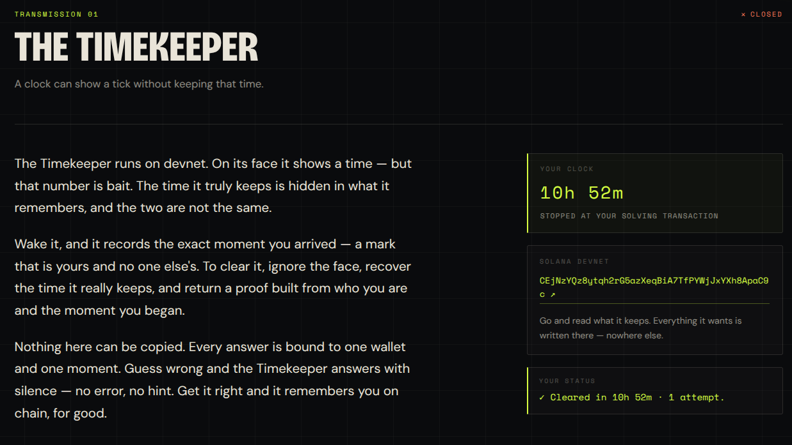

# The Timekeeper

Solana Summit India challenge `c1`.



## Key addresses

| Name | Value |
|------|-------|
| Program ID | `CEjNzYQz8ytqh2rG5azXeqBiA7TfPYWjJxYXh8ApaC9c` |
| Oracle PDA | `2zB14azTxRdtASHgxeBKgvCsNxwNVGgDv8GzbgRGxTWu` (seed `"oracle"`) |
| Progress PDA | per-wallet, seeds `["progress", wallet]` |

Instruction discriminators (first data byte): `0` initialize · `1` wake · `2` clear.

## Prerequisites

- Rust + the Solana toolchain (`cargo build-sbf`), Solana CLI (`solana-cli` 3.x / Agave).
- A funded devnet keypair, e.g. `~/.config/solana/id.json`:
  ```bash
  solana airdrop 1 -u devnet
  ```

## Build

```bash
# On-chain program → target/deploy/timekeeper.so
cargo build-sbf

# Solver binary (host-only deps behind the `solver` feature)
cargo build --bin solver --features solver
```

## Test

`cargo test` runs Mollusk tests for both local and devnet program.

## Solve

Both solvers do the same flow: `wake` (idempotent) → read `arrival_slot` →
compute proof `sha256(wallet ‖ sha256^chime_count(genesis_seed) ‖ arrival_slot)`
→ simulate + send `clear`.

```bash
cargo run --bin solver --features solver                       # default keypair
cargo run --bin solver --features solver -- /path/to/id.json   # explicit keypair
```

## Dump from devnet

```bash
# Program binary → artifacts/timekeeper_devnet.so
solana program dump -u devnet \
  CEjNzYQz8ytqh2rG5azXeqBiA7TfPYWjJxYXh8ApaC9c \
  artifacts/timekeeper_devnet.so

# Oracle account raw data → artifacts/oracle.bin
solana account -u devnet \
  2zB14azTxRdtASHgxeBKgvCsNxwNVGgDv8GzbgRGxTWu \
  --output-file artifacts/oracle.bin

# Inspect the oracle account (JSON, no file)
solana account -u devnet 2zB14azTxRdtASHgxeBKgvCsNxwNVGgDv8GzbgRGxTWu --output json

# Hex view of the dumped oracle
xxd artifacts/oracle.bin | head
```

## Derive PDAs

```bash
# Oracle PDA
solana find-program-derived-address \
  CEjNzYQz8ytqh2rG5azXeqBiA7TfPYWjJxYXh8ApaC9c string:oracle

# Progress PDA for a specific wallet
solana find-program-derived-address \
  CEjNzYQz8ytqh2rG5azXeqBiA7TfPYWjJxYXh8ApaC9c \
  string:progress pubkey:<WALLET_PUBKEY>
```

## Account layouts

`Oracle` (498 bytes):

| offset | field | size |
|--------|-------|------|
| 0 | problem `"TMKPR1"` | 6 |
| 6 | tag (`1`) | 1 |
| 7 | chime_count (`64`) | 1 |
| 8 | genesis_seed | 32 |
| 40 | commitment | 32 |
| 72 | genesis_slot (LE) | 8 |
| 80 | message | 418 |

`Progress` (60 bytes):

| offset | field | size |
|--------|-------|------|
| 0 | problem `"TMKPR1"` | 6 |
| 6 | tag (`2`) | 1 |
| 7 | wallet | 32 |
| 39 | arrival_slot (LE) | 8 |
| 47 | attempts (u32 LE) | 4 |
| 51 | solved (`0`/`1`) | 1 |
| 52 | solved_slot (LE) | 8 |

## Artifacts

| File | What |
|------|------|
| `artifacts/timekeeper_devnet.so` | Program binary dumped from devnet |
| `artifacts/oracle.bin` | Oracle account raw data (used as a test fixture) |
| `target/deploy/timekeeper.so` | Locally built program (`cargo build-sbf`) |
